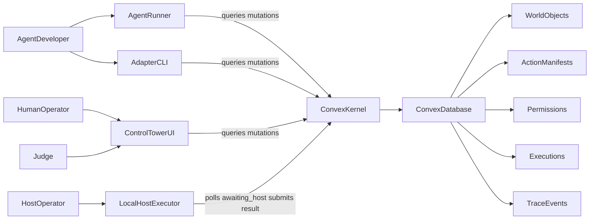
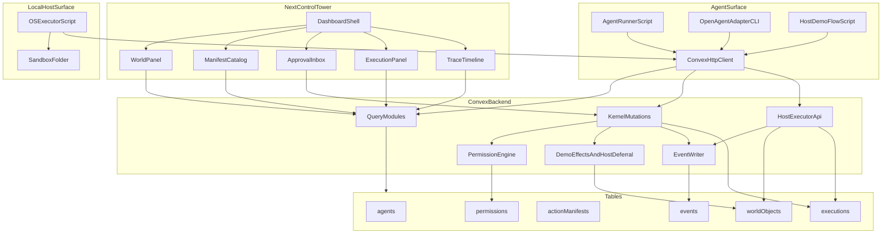
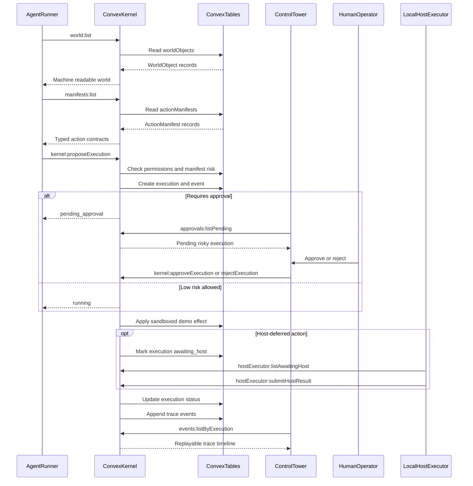
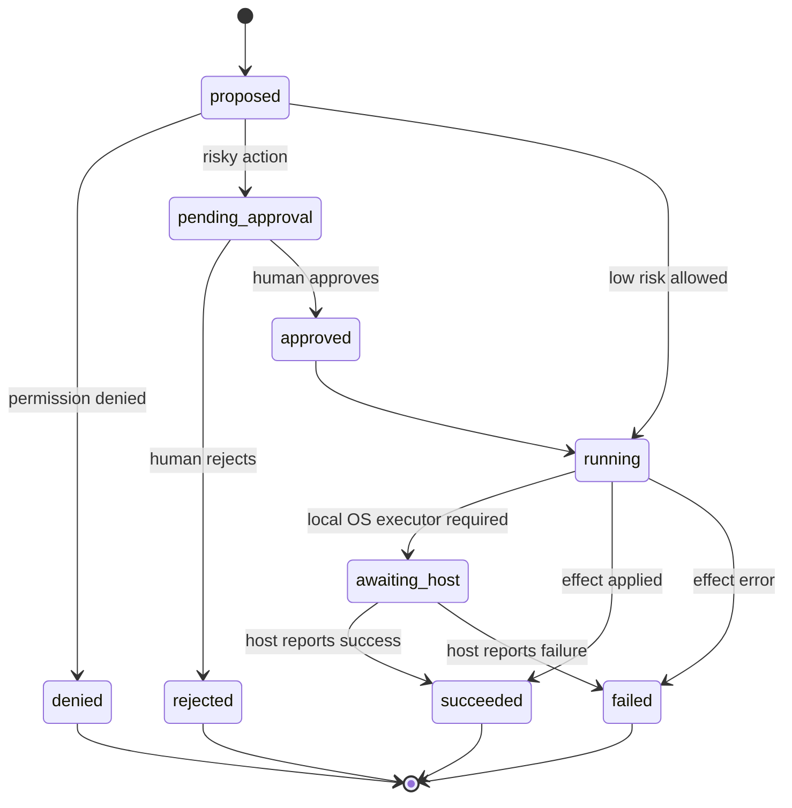

# OpenAgentOS architecture

This document mirrors the implemented MVP architecture: Convex is the realtime kernel; the Control Tower, agent runner, adapter CLI, and local host executor are clients of the same contract (`docs/CONTRACT.md`).

## System context

## Component view

## Execution sequence

## Execution lifecycle

## Trust boundaries

- **Convex kernel** enforces permissions (default deny), risk/approval gating, execution transitions, and trace writes.
- **Control Tower** is display and human intent only; it must not decide authorization.
- **Agent runner and adapter CLI** are reference agent integrations: they read world/manifests, propose executions, and inspect traces without scraping the UI.
- **Local host executor** is the only component allowed to touch the filesystem, and it must stay under `OPENAGENTOS_EXECUTOR_ROOT`.

## Key files

| Area | Path |
| --- | --- |
| Schema | `convex/schema.ts` |
| Kernel / lifecycle | `convex/kernel.ts` |
| Events helper | `convex/lib/events.ts` |
| DTO mappers | `convex/lib/shapes.ts` |
| Shared TS shapes | `shared/contracts.ts` |
| Contract doc | `docs/CONTRACT.md` |
| API map | `docs/CONVEX_API.md` |
| Control Tower | `app/page.tsx`, `app/components/control-tower/*` |
| Agent smoke | `scripts/agent-runner.ts` |
| Adapter CLI | `scripts/openagent-adapter.ts` |
| Local host executor | `scripts/os-executor.ts`, `convex/hostExecutor.ts` |
| Scripted host demo | `scripts/host-demo-flow.ts` |
